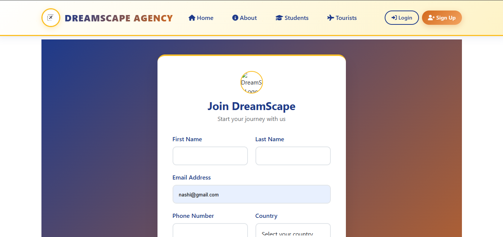
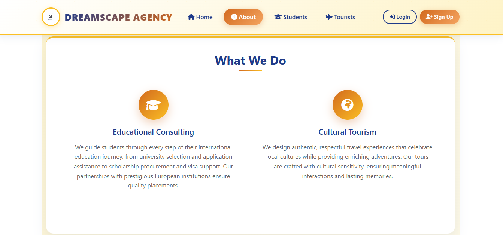
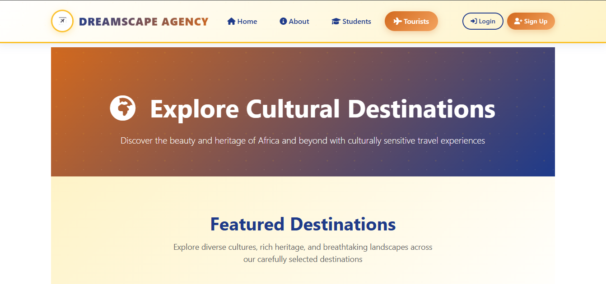
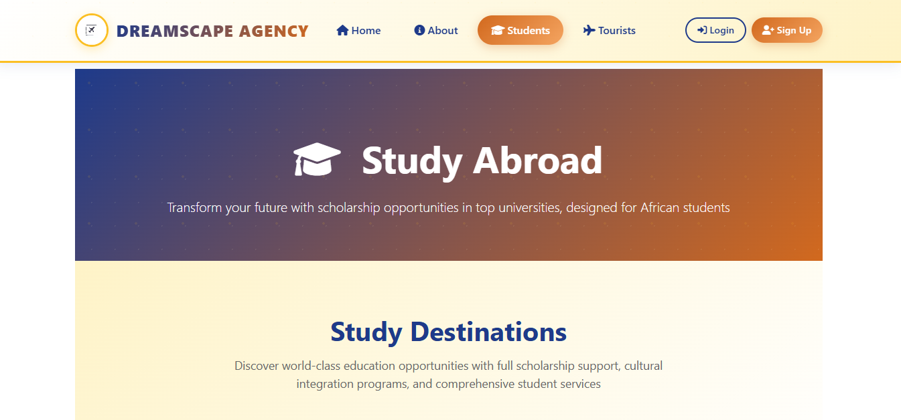

<p align="center">
  
</p>

<h1 align="center">🌍 DreamScape</h1>

<p align="center">
  <em>Your gateway to global education & unforgettable travel experiences</em>
</p>

<p align="center">
  
  
  
  
</p>

---

## 📖 About

**DreamScape** is a full-stack Django web application that connects aspiring students with international scholarship opportunities and helps travelers discover breathtaking destinations across the globe. Whether you're dreaming of studying abroad in Poland, Northern Cyprus, or Denmark — or planning your next adventure to Zambia, Ghana, Dubai, and beyond — DreamScape is your all-in-one platform to make it happen.

---

## ✨ Features

### 🎓 Student Services
- **Study Abroad Destinations** — Browse curated study destinations with detailed info on tuition, living costs, and available scholarships
- **University Explorer** — Explore partner schools within each country, complete with image galleries
- **Scholarship Applications** — Submit applications for study programs with country-specific forms
- **Application Tracking** — View submitted applications from your user profile

### 🗺️ Tourist Services
- **Destination Discovery** — Explore tourist countries with rich descriptions and image galleries
- **Attraction Sites** — Dive into individual attractions within each destination
- **Travel Inquiries** — Submit trip-planning inquiries with preferred dates, group size, and destination details
- **Smart Pre-filling** — Forms auto-populate with destination and attraction context from browsing

### 👤 User Management
- **Email-Based Authentication** — Custom user model with email as the primary identifier (no username required)
- **User Profiles** — Dashboard showing your submitted applications, inquiries, and testimonials
- **Secure Sign Up & Login** — Full registration and authentication flow

### 💬 Testimonials
- **Community Reviews** — Read approved testimonials from fellow students and travelers
- **Submit Feedback** — Share your experience with star ratings and service categories
- **Admin Moderation** — Testimonials require admin approval before going public

### 🎨 Dynamic Content
- **Admin-Managed Carousel** — Homepage carousel images configurable from the Django admin
- **Media Uploads** — Full image management for destinations, schools, and attractions
- **Responsive Design** — Beautiful UI with custom CSS and JavaScript

---

## 🖼️ Demo

<p align="center">
  
  <br/><em>Homepage — Hero carousel with student & tourist services</em>
</p>

<p align="center">
  
  <br/><em>Student Destinations — Browse study-abroad countries</em>
</p>

<p align="center">
  
  <br/><em>Application Form — Submit scholarship applications</em>
</p>

<p align="center">
  
  <br/><em>Tourist Destinations — Discover travel destinations</em>
</p>

<p align="center">
  
  <br/><em>Testimonials — Community reviews & ratings</em>
</p>

---

## 🏗️ Project Structure

```
dream-scape/
├── dream_scape/            # Project configuration
│   ├── settings.py         # Django settings
│   ├── urls.py             # Root URL configuration
│   ├── wsgi.py             # WSGI entry point
│   └── asgi.py             # ASGI entry point
│
├── services/               # Core services app
│   ├── models.py           # Testimonial model
│   ├── views.py            # Homepage, about, testimonials views
│   ├── forms.py            # Testimonial form
│   └── templates/          # Service templates
│
├── student_travel/         # Travel & education app
│   ├── models.py           # Destinations, schools, attractions, applications
│   ├── views.py            # Student & tourist views, applications, inquiries
│   ├── forms.py            # Application & inquiry forms
│   └── templates/          # Travel templates
│
├── users/                  # Authentication app
│   ├── models.py           # Custom User model (email-based)
│   ├── views.py            # Signup, login, logout, profile views
│   ├── forms.py            # Registration form
│   └── templates/          # Auth templates
│
├── templates/              # Global templates
│   ├── base.html           # Base layout
│   ├── navbar.html         # Navigation bar
│   └── footer.html         # Footer
│
├── static/                 # Static assets
│   ├── css/                # Stylesheets
│   ├── js/                 # JavaScript files
│   ├── images/             # Static images
│   └── demo/               # Demo screenshots
│
├── media/                  # User-uploaded files
├── manage.py               # Django management script
├── requirements.txt        # Python dependencies
└── db.sqlite3              # SQLite database
```

---

## 🚀 Getting Started

### Prerequisites

- **Python 3.10+** — [Download Python](https://www.python.org/downloads/)
- **Git** — [Download Git](https://git-scm.com/downloads)
- **pip** — Comes bundled with Python

---

### 1️⃣ Fork & Clone the Repository

1. Click the **Fork** button at the top-right of this repository page to create your own copy.
2. Clone your forked repository:

```bash
git clone https://github.com/Nashiol/dream-scape.git
cd dream-scape
```

> Replace `<your-username>` with your GitHub username.

---

### 2️⃣ Create a Virtual Environment

#### On Windows:
```bash
python -m venv venv
venv\Scripts\activate
```

#### On macOS / Linux:
```bash
python3 -m venv venv
source venv/bin/activate
```

You should see `(venv)` at the beginning of your terminal prompt, confirming the virtual environment is active.

---

### 3️⃣ Install Dependencies

```bash
pip install -r requirements.txt
```

---

### 4️⃣ Run Database Migrations

Apply all database migrations to set up the SQLite database:

```bash
python manage.py makemigrations
python manage.py migrate
```

---

### 5️⃣ Create a Superuser (Admin)

Create an admin account to access the Django admin panel:

```bash
python manage.py createsuperuser
```

You'll be prompted to enter an **email** and **password** (this project uses email-based authentication — no username needed).

---

### 6️⃣ Run the Development Server

```bash
python manage.py runserver
```

Open your browser and navigate to:

| Page               | URL                                      |
|---------------------|------------------------------------------|
| 🏠 **Homepage**     | [http://127.0.0.1:8000/](http://127.0.0.1:8000/) |
| 🔧 **Admin Panel**  | [http://127.0.0.1:8000/admin/](http://127.0.0.1:8000/admin/) |
| 👤 **Sign Up**      | [http://127.0.0.1:8000/users/signup/](http://127.0.0.1:8000/users/signup/) |
| 🔑 **Login**        | [http://127.0.0.1:8000/users/login/](http://127.0.0.1:8000/users/login/) |

---

## ⚙️ Configuration

### Environment Variables

For production, make sure to configure the following in `dream_scape/settings.py`:

| Setting          | Description                          | Default          |
|-------------------|--------------------------------------|------------------|
| `SECRET_KEY`      | Django secret key                    | Auto-generated   |
| `DEBUG`           | Debug mode toggle                    | `True`           |
| `ALLOWED_HOSTS`   | Allowed hostnames                    | `['*']`          |
| `DATABASES`       | Database configuration               | SQLite           |

> ⚠️ **Security Note:** Never deploy with `DEBUG = True` or the default `SECRET_KEY` in production. Use environment variables to manage secrets.

---

## 🛠️ Tech Stack

| Technology             | Purpose                           |
|------------------------|-----------------------------------|
| **Django 5.2**         | Web framework                     |
| **SQLite**             | Default database                  |
| **Pillow**             | Image processing & uploads        |
| **Django REST Framework** | API capabilities               |
| **django-allauth**     | Authentication extensions         |
| **SimpleJWT**          | JWT token authentication          |
| **HTML / CSS / JS**    | Frontend interface                |

---

## 🤝 Contributing

Contributions are welcome! Here's how you can help:

1. **Fork** the repository
2. **Create** a feature branch:
   ```bash
   git checkout -b feature/amazing-feature
   ```
3. **Commit** your changes:
   ```bash
   git commit -m "Add amazing feature"
   ```
4. **Push** to the branch:
   ```bash
   git push origin feature/amazing-feature
   ```
5. **Open** a Pull Request

---

## 📄 License

This project is open source and available under the [MIT License](LICENSE).

---

<p align="center">
  Built with ❤️ using Django
</p>
